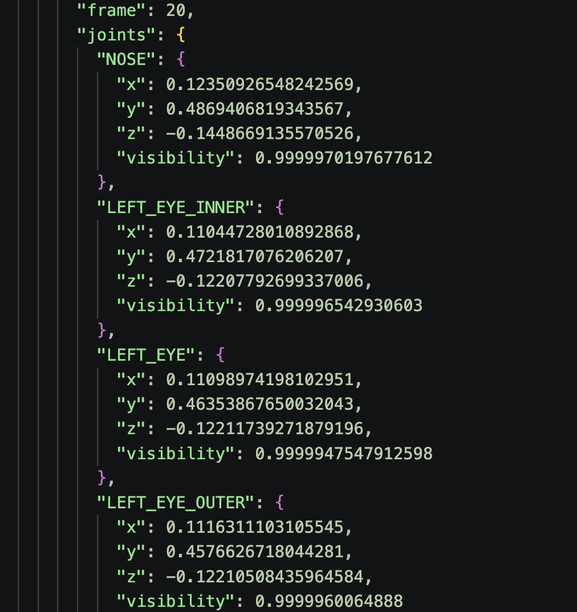
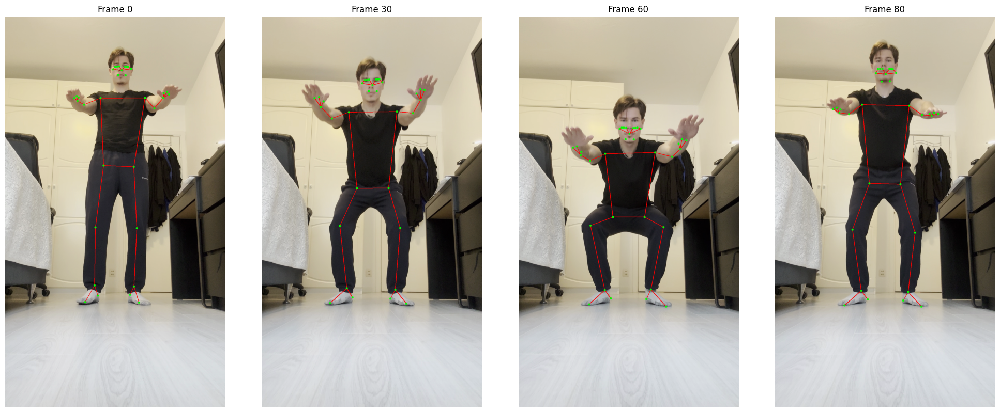

## Report assignment 8, group 6

## ML

After Sebastians suggestion we choose to use Pytourch for our ML framework. All group members read the tutorial for Pytourch.

## Pose estimation

The pose estimation used was the googles Mediapipe and Enis created a test squat video for us to see that our functions work as should. The media pipe has 33 pose landmarks and for each landmark we get the x and y cordinate for the landmark as well as z which represents the "depth with the depth at the midpoint of hips being the origin, and the smaller the value the closer the landmark is to the camera" and visibility which gives the likelihood of the landmark being visible. For each video we store all the previous data for each landmarks for each frame of the video in a json file. All features from all landmarks are stored since the neural network can "filter" out the neccecary ones for our purpose.

In the image below we show an example of how our data is stored in our json file. 

In the picture below we plot our saved joint points for a few frames. We can see that for the joints on the same level to the camera, like knees and feet joints, we have good accuracy. But the accuracy for face and hand the accuracy is not super. 

## Software develepment 

The current "software level" is low meaning we manually in our code give the path to our video file or image. This is a area which will probably be improved but this week the group wanted some easter vacation and the level wanted is a bit unclear. 
