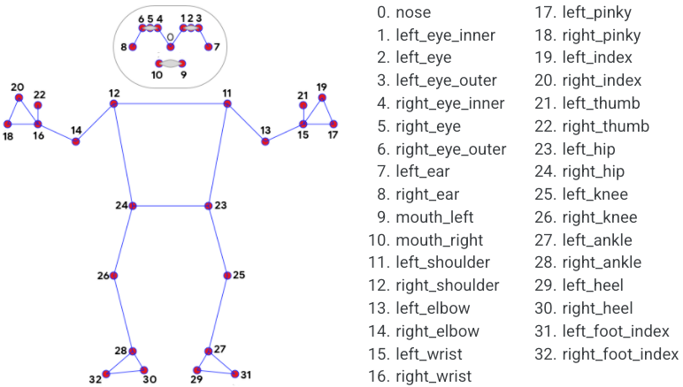

## Report assignment 8, group 6

## ML

After Sebastians suggestion, we choose to use Pytorch for our ML framework. All group members read the tutorial for Pytorch.

## Pose estimation

The pose estimation used was googles Mediapipe. Enis created a test squat video for us to see how our functions worked and how reliable they are. Mediapipe has 33 pose landmarks and for each landmark we get the normalized x and y cordinates as well as the percieved z-coordinate which represents the "depth". The depth is defined such that the midpoint of the hips is the origin, and the smaller the value the closer the landmark is to the camera. We also get a visibility-value for the landmarks which gives the likelihood of the landmark being visible. For each video being managed and for each frame of the video the coordinate and visibility data for each landmark are stored in a json file. All features from all landmarks are stored right now, whether the landmark is significant or not, this is because the neural networks that we will later apply can "filter" out the neccecary ones for our purpose.

### JSON configuration
In the image below we show an example of how our data is stored in our json file. 

### Landmark legend
Here we can see the different landmarks that the model is looking for and what index they correspond to. https://chuoling.github.io/mediapipe/solutions/pose.html

### Example output
In the image below we demonstrate how the model is performing under the squat and how accurate it is.
The model performs good in the beginning with the standing pose as we can see that the landmarks are indeed where we expect them to be. But later on in the squat we see that the landmarks in the upper body seem to shift downwards a bit, which might make the program believe we perform a full squat even though we only go halfway. But this remains to be seen.

## Software develepment 

The current "software level" is low, meaning we manually insert the path to our video file or image. This is an area which will probably be improved, but this week the group wanted some Easter vacation and the level wanted is a bit unclear. 

## Group work

So far we have all worked individually to ensure we all have an understanding of how mediapipe works. We did this to ensure that nobody worked solely on video choice or landmark plotting, preventing them from tinkering and learning mediapipe.
We have also voted for who we believe to have made the best/cleanest/simplest code and selected that persons code as the main program moving forward (that person being Jacob).