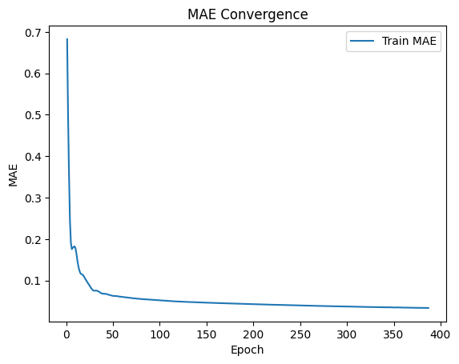
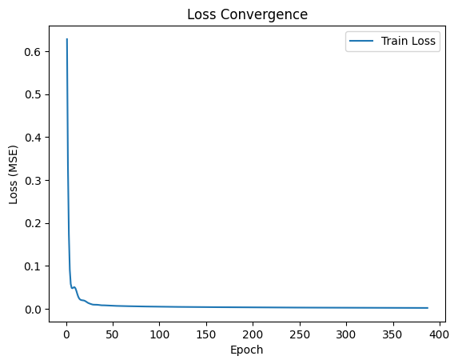

## Report assignment 9, group 6

## ML

### Data Loading & Preprocessing

The first step was loading the data, which was a relatively straightforward task. The dataset consisted of time-series pose estimation data from Kinect sensors, containing 13 joints with x and y coordinates (26 features total) as input, with the target being the next frame's joint positions (13 coordinates). Each file represented one complete squat sequence, with varying lengths across different recordings. In order to train and evaluate our models without look-ahead bias we split the files into groups of training- and tesfiles, the split was made such that 90 percent of files became trainingfiles while the remaining 10 percent became testfiles. First we also included a set of validationfiles, forming 10% of all the datafiles such that the proprtions were 80/10/10 but later on we realized that k-fold cross validation made the validation set useless from which we decided on the 90/10 split. 

### Experiment Tracking with MLflow

The next step was setting up MLflow to log all runs, experiments, and model artifacts. Without this, it would have been impossible to systematically compare different hyperparameter configurations and track model performance over time.

### Training
Before we could start to train models on our data we created a general model using pytorch's neural network library, we specified the model's input and output dimensions since we knew these from the datasets, aswell as it's initial weights which we chose from some research, but the rest of the model we kept general such that we could modify it smoothly in the quest of optimizing it's performance. To optimize the model's performance all of us ran grid search locally on our computers, using mlflow we could smoothly log both configurations and the corresponding performance metrics for each model. Our assessment of models skill depended mostly on the mse values we got from predictions on validation data. We chose mse because we needed an evaluation metric suitable for regression and it penalizes outliers more than for example mae which feels desirable in our setting of tracking z-coordinates. Training in this manner, using different grids we all got ourselves a champion model and from these we chose the best one.

### Hyperparameters

**Activation Functions:** ReLU, Leaky ReLU, tanh and gelu were tested within our gridsearch. According to literature, ReLU is the recommended default choice and in accordance with this it appeared frequently in our most sucessful models.

**Optimizer:** Regarding optimizers we tried both Adam, rmsprop and sgd, the results were quite similar for all of them.

**Network Architecture:** The size and number of hidden layers were the most critical hyperparameters. Configurations tested included [256,128,128,64,64] (5 layers), [256,128,128,64] (4 layers), [256,128,64] (3 layers), and [128,64] (2 layers) with more. LSTM, GRU, and Dense architectures were compared.

**Dropout Rate:** Dropout rates between 0.0 and 0.4 were tested. This regularization technique randomly turns off nodes during training to prevent overfitting.

**Weight Decay (L2 Regularization):** Weight decay values from 0 to 1e-5 were tested. When regularization was too large (1e-5), the model underfit.

**Learning Rate:** Learning rates of 0.0005 and 0.001 were tested, but no significant difference was observed.

**Early Stopping Patience:** This was implemented to stop training when validation loss stopped improving, preventing overfitting. 

### Errors 

**Padding Evaluation Mistake:** A critical oversight was that after padding the time-series data, we evaluated our models including the padded zeros. Since predicting zeros for padded frames is trivial, this artificially inflated our performance metrics.

### Future works

- **Domain Adaptation:** Possibility to transform Google MediaPipe pose estimations to Kinect-style data.

- **Coordination:** For upcoming tasks we will consider how to organize and distribute the work among ourselves to become more time-efficient as a group.

- **Frames** 

- **Augment data**

- **Normilising data**

- **Increase K possibly**

## Software Development

To make the model easy to train again and reuse, we created a clear and structured workflow.

The training is controlled by a dictionary of hyperparameters. This means we can change things like the amount of layers, layer-width or learning rate without changing the actual code. Because of this, it is easy to train the model again with new data or different parameters.

Every trained model can be saved to a file in a folder candidates. This means we do not need to train the model again every time we want to use it. We do not use this at the moment however but this is just due to that we have the system below, that tracks the so far best model, ehich we are more interested in than the less sucessful models.

We also created a system to keep track of the best model, called the champion model. The best model is chosen based on how well it performs on validation data (using mean squared error). It is also saved in a folder called champion.

If a new model performs better than the current champion, it replaces it. We also save information about the model, such as its parameters and performance in the folder metadata. This makes it possible to always go back and use the best model.

Overall, this makes the system easy to use, update, and improve without needing a lot of manual work.

## Champion Model (as of now)
### Configuration

**Hidden layers and layer widths:** [256, 128, 64] Dense

**Learning rate:** 0.001

**Dropout:** 0

**Activation:** relu

**Optimizer:** Adam

**Epochs:** 500

**Patience:** 5

### Metrics

| Metric |  Train   |   Test   |
|-----   |----------|----------|
|  MSE   | 0.002057 | 0.004530 |
|  MAE   | 0.033828 | 0.047920 |
|  R2    | 0.779359 | 0.455292 |
|  Bias  | 0.000841 | 0.018974 |

### Joint accuracy
MAE per joint: 

head: 4.608358 cm 

left_shoulder: 4.477446 cm

left_elbow: 4.969401 cm

right_shoulder: 4.450579 cm

right_elbow: 5.944175 cm

left_hand: 5.893731 cm

right_hand: 6.237015 cm

left_hip: 3.857303 cm

right_hip: 3.846220 cm

left_knee: 4.268326 cm

right_knee: 5.296071 cm

left_foot: 3.914719 cm

right_foot: 4.532589 cm

Average MAE:  4.791995 cm

### Learning curves

